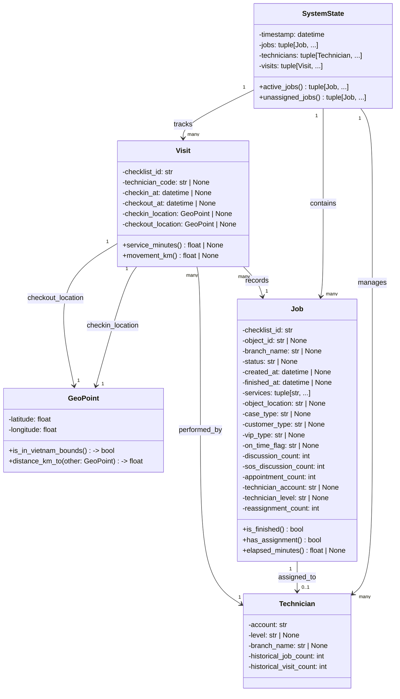

# UML Diagram - KTV Optimization System

## Architecture Overview

Sơ đồ UML dưới đây thể hiện kiến trúc OOP của hệ thống tối ưu hóa KTV (Kỹ Thuật Viên):



---

## Detailed Class Hierarchy

### 🏛️ Domain Layer (Tầng Miền)

Chứa các đối tượng business core không phụ thuộc vào infrastructure.

#### 1. **GeoPoint** - Vị trí địa lý
- **Mục đích**: Biểu diễn một điểm tọa độ GPS
- **Thuộc tính**:
  - `latitude: float` - Vĩ độ (độ)
  - `longitude: float` - Kinh độ (độ)
- **Phương thức**:
  - `is_in_vietnam_bounds() -> bool` - Kiểm tra điểm có nằm trong ranh giới Việt Nam (8°N-24°N, 102°E-110°E)
  - `distance_km_to(other: GeoPoint) -> float` - Tính khoảng cách giữa hai điểm (km) sử dụng Haversine formula

#### 2. **Job** - Nhiệm vụ bảo trì
- **Mục đích**: Đại diện cho một checklist bảo trì duy nhất
- **Thuộc tính chính**:
  - `checklist_id: str` - ID duy nhất
  - `object_id: str | None` - Mã hợp đồng/đối tượng
  - `status: str | None` - Trạng thái xử lý (Chưa phân công, Đã phân công, v.v.)
  - `services: tuple[str, ...]` - Danh sách dịch vụ cần kiểm tra
  - `created_at: datetime | None` - Thời gian tạo
  - `finished_at: datetime | None` - Thời gian hoàn tất
  - `technician_account: str | None` - KTV được gán
- **Thuộc tính theo dõi**:
  - `discussion_count: int` - Số lần giục
  - `sos_discussion_count: int` - Số lần bị giục ở mức SOS
  - `appointment_count: int` - Số lần hẹn xử lý
  - `reassignment_count: int` - Số lần thay đổi KTV
- **Thuộc tính phân loại**:
  - `branch_name: str | None` - Chi nhánh
  - `customer_type: str | None` - Loại khách hàng
  - `vip_type: str | None` - Phân loại VIP
  - `on_time_flag: str | None` - Trạng thái SLA (YES/NO/NA/INPROCESS)
  - `case_type: str | None` - Loại ca vụ
  - `object_location: str | None` - Địa chỉ lắp đặt
  - `technician_level: str | None` - Cấp độ KTV được gán
- **Phương thức**:
  - `is_finished() -> bool` - Kiểm tra đã hoàn tất (trả về True nếu `finished_at` không None)
  - `has_assignment() -> bool` - Kiểm tra đã được gán KTV (trả về True nếu `technician_account` có giá trị)
  - `elapsed_minutes() -> float | None` - Tính thời gian đã trôi qua (phút) từ `created_at` đến `finished_at`

#### 3. **Technician** - Kỹ thuật viên
- **Mục đích**: Đại diện cho một nhân viên kỹ thuật
- **Thuộc tính**:
  - `account: str` - Account định danh (khóa chính)
  - `level: str | None` - Cấp độ nghiệp vụ
  - `branch_name: str | None` - Chi nhánh trực thuộc
  - `historical_job_count: int` - Số checklist từng xử lý
  - `historical_visit_count: int` - Số lượt check-in từng thực hiện
- **Phương thức**: Không có (là value object)

#### 4. **Visit** - Lượt thực hiện công việc
- **Mục đích**: Ghi lại mỗi lần KTV check-in/check-out
- **Thuộc tính**:
  - `checklist_id: str` - Checklist mà lượt này phục vụ
  - `technician_code: str | None` - Mã nhân viên
  - `checkin_at: datetime | None` - Thời gian bắt đầu
  - `checkout_at: datetime | None` - Thời gian kết thúc
  - `checkin_location: GeoPoint | None` - GPS tại check-in
  - `checkout_location: GeoPoint | None` - GPS tại check-out
- **Phương thức**:
  - `service_minutes() -> float | None` - Tính thời gian làm việc (phút) từ `checkin_at` đến `checkout_at`
  - `movement_km() -> float | None` - Tính quãng đường di chuyển (km) từ `checkin_location` đến `checkout_location`

#### 5. **SystemState** - Trạng thái hệ thống
- **Mục đích**: Snapshot không thay đổi của toàn bộ trạng thái tại một thời điểm
- **Thuộc tính**:
  - `timestamp: datetime` - Thời điểm chụp snapshot
  - `jobs: tuple[Job, ...]` - Tất cả checklist
  - `technicians: tuple[Technician, ...]` - Tất cả KTV
  - `visits: tuple[Visit, ...]` - Các lượt thực hiện đã biết (default rỗng)
- **Phương thức**:
  - `active_jobs() -> tuple[Job, ...]` - Lấy các checklist chưa hoàn tất (là các Job mà `is_finished()` trả về False)
  - `unassigned_jobs() -> tuple[Job, ...]` - Lấy các checklist chưa được gán KTV (là các active_jobs mà `has_assignment()` trả về False)

---

## 📊 Relationship Patterns

### Mối Quan Hệ Chính:

1. **SystemState → Job** (1:N)
   - Một snapshot chứa nhiều checklist
   - Job là bất biến (immutable), được tạo từ dữ liệu CSV

2. **SystemState → Technician** (1:N)
   - Một snapshot quản lý danh sách KTV
   - Mỗi Technician là một đơn vị độc lập

3. **SystemState → Visit** (1:N)
   - Một snapshot theo dõi tất cả lượt thực hiện
   - Visit ghi lại các sự kiện check-in/out

4. **Job ← Technician** (N:1)
   - Một Job có thể được gán cho một Technician
   - Một Technician có thể xử lý nhiều Job

5. **Visit → Job** (N:1)
   - Một lượt Visit phục vụ một Job
   - Một Job có thể có nhiều Visit (ví dụ: 2 lần check-in/out)

6. **Visit → Technician** (N:1)
   - Một Visit được thực hiện bởi một Technician
   - Một Technician có nhiều Visit

7. **Visit → GeoPoint** (N:1)
   - Mỗi Visit có 2 GeoPoint (check-in và check-out)

---

## 🔧 Chi Tiết Tất Cả Các Method

### GeoPoint Methods

| Method | Signature | Return Type | Mô Tả |
|--------|-----------|-------------|-------|
| `is_in_vietnam_bounds` | `is_in_vietnam_bounds(self)` | `bool` | Kiểm tra tọa độ có nằm trong ranh giới Việt Nam (8°N-24°N, 102°E-110°E) |
| `distance_km_to` | `distance_km_to(self, other: GeoPoint)` | `float` | Tính khoảng cách giữa 2 điểm sử dụng công thức Haversine (great-circle distance) |

**Ví dụ:**
```python
point1 = GeoPoint(21.0285, 105.8542)  # Hà Nội
point2 = GeoPoint(10.7769, 106.7009)  # TP.HCM

point1.is_in_vietnam_bounds()        # True
point1.distance_km_to(point2)        # ~1693.5 km
```

---

### Job Methods

| Method | Signature | Return Type | Mô Tả |
|--------|-----------|-------------|-------|
| `is_finished` | `@property is_finished(self)` | `bool` | Kiểm tra Job đã hoàn tất: `finished_at is not None` |
| `has_assignment` | `@property has_assignment(self)` | `bool` | Kiểm tra Job đã được gán KTV: `bool(technician_account)` |
| `elapsed_minutes` | `@property elapsed_minutes(self)` | `float \| None` | Tính thời gian trôi qua (phút): `(finished_at - created_at).total_seconds() / 60` |

**Ví dụ:**
```python
job = Job(
    checklist_id="CLK-2026-001",
    status="Đang xử lý",
    created_at=datetime(2026, 9, 10, 9, 0),
    finished_at=datetime(2026, 9, 10, 11, 30),
    technician_account="A001",
    # ... other fields
)

job.is_finished          # True
job.has_assignment       # True
job.elapsed_minutes      # 150.0 phút
```

---

### Technician Methods

| Method | Signature | Return Type | Mô Tả |
|--------|-----------|-------------|-------|
| *(Không có method)* | - | - | Technician là value object thuần túy |

**Ghi chú:** Technician chỉ lưu trữ thông tin, không có logic tính toán.

---

### Visit Methods

| Method | Signature | Return Type | Mô Tả |
|--------|-----------|-------------|-------|
| `service_minutes` | `@property service_minutes(self)` | `float \| None` | Tính thời gian làm việc (phút): `(checkout_at - checkin_at).total_seconds() / 60` |
| `movement_km` | `@property movement_km(self)` | `float \| None` | Tính quãng đường di chuyển (km): `checkin_location.distance_km_to(checkout_location)` |

**Ví dụ:**
```python
visit = Visit(
    checklist_id="CLK-2026-001",
    technician_code="A001",
    checkin_at=datetime(2026, 9, 10, 9, 0),
    checkout_at=datetime(2026, 9, 10, 10, 30),
    checkin_location=GeoPoint(21.0285, 105.8542),    # Công ty XYZ
    checkout_location=GeoPoint(21.0500, 105.8700),   # Nhà máy ABC
)

visit.service_minutes    # 90.0 phút
visit.movement_km        # ~3.5 km
```

---

### SystemState Methods

| Method | Signature | Return Type | Mô Tả |
|--------|-----------|-------------|-------|
| `active_jobs` | `@property active_jobs(self)` | `tuple[Job, ...]` | Lọc các Job chưa hoàn tất: `tuple(job for job in jobs if not job.is_finished)` |
| `unassigned_jobs` | `@property unassigned_jobs(self)` | `tuple[Job, ...]` | Lọc các active Job chưa được gán: `tuple(job for job in active_jobs if not job.has_assignment)` |

**Ví dụ:**
```python
state = SystemState(
    timestamp=datetime.now(),
    jobs=(job1, job2, job3, job4),  # 4 jobs
    technicians=(tech1, tech2),
    visits=()
)

# job1: hoàn tất, có gán KTV
# job2: hoàn tất, không gán KTV
# job3: chưa hoàn tất, có gán KTV
# job4: chưa hoàn tất, không gán KTV

state.active_jobs        # (job3, job4)
state.unassigned_jobs    # (job4,)
```

---


### 1. **Immutable Data Objects (Frozen Dataclass)**
```python
@dataclass(frozen=True, slots=True)
class Job:
    ...
```
- **Lợi ích**: Thread-safe, dễ debug, hiệu suất tốt
- **Ứng dụng**: Tất cả domain models đều immutable

### 2. **Property Pattern**
```python
@property
def is_finished(self) -> bool:
    return self.finished_at is not None
```
- **Lợi ích**: Encapsulation, logic dễ đọc
- **Ứng dụng**: Computed properties như `active_jobs`, `unassigned_jobs`

### 3. **Value Object Pattern**
- `GeoPoint`: Không có ID riêng, được so sánh theo giá trị
- `SystemState`: Đại diện một snapshot toàn bộ trạng thái tại một thời điểm

### 4. **Composition Pattern**
- `SystemState` chứa `Job`, `Technician`, `Visit` (không thừa kế)

---

## 📦 Các Module Liên Quan

### Tầng Data (`src/ktv_optimizer/data/`)
- **Mappers**: Chuyển đổi dữ liệu CSV → Domain objects
- **Validators**: Kiểm tra tính hợp lệ dữ liệu
- **Sources**: Tải dữ liệu từ nhiều nguồn (CSV, GeoJSON)

### Tầng Optimization (`src/ktv_optimizer/optimization/`)
- **Assignment**: Gán Job cho Technician
- **Routing**: Tối ưu tuyến đường
- **Scoring**: Đánh giá chất lượng phân công
- **Clustering**: Nhóm Job theo vùng địa lý

### Tầng Evaluation (`src/ktv_optimizer/evaluation/`)
- **Outcome**: Đánh giá kết quả thực tế của phân công

### Tầng State (`src/ktv_optimizer/state/`)
- **Snapshot**: Quản lý snapshot trạng thái
- **Reducer**: Xử lý các thay đổi trạng thái
- **Queue**: Quản lý hàng đợi Job

---

## 🎯 Use Case Chính

### 1. Load và Parse Dữ Liệu
```
CSV File → Mapper → Job/Technician Objects → SystemState
```

### 2. Phân Công Job cho KTV
```
SystemState.unassigned_jobs → Assignment Engine → Job(technician_account=...) → Updated SystemState
```

### 3. Theo Dõi Thực Hiện Công Việc
```
Technician check-in/out → Visit Objects → SystemState.visits
GeoPoint (latitude, longitude) → distance_km_to() → optimization
```

### 4. Đánh Giá Hiệu Suất
```
SystemState + Job history → Evaluation → Performance Metrics
```

---

## 💡 Lợi Ích Của Kiến Trúc OOP Này

1. **Tách biệt Concern**: Domain logic hoàn toàn độc lập với data storage
2. **Khả năng Mở Rộng**: Dễ thêm các attribute mới mà không làm ảnh hưởng các module khác
3. **Testability**: Mỗi class có trách nhiệm rõ ràng, dễ viết unit test
4. **Type Safety**: Sử dụng Python dataclass giúp type checking tốt hơn
5. **Immutability**: Ngăn chặn unintended side effects
6. **Performance**: Slots tối ưu bộ nhớ, frozen dataclass tối ưu hashing

---

*Diagram này được tạo dựa trên phân tích mã nguồn tại:*
- `src/ktv_optimizer/domain/`
- `src/ktv_optimizer/optimization/`
- `src/ktv_optimizer/state/`
