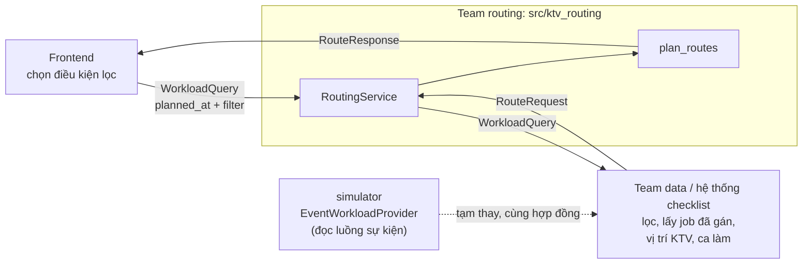
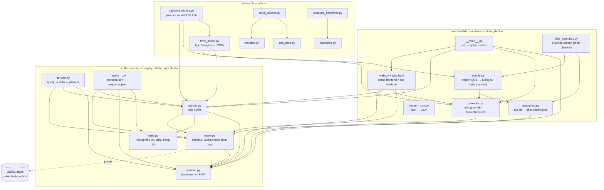
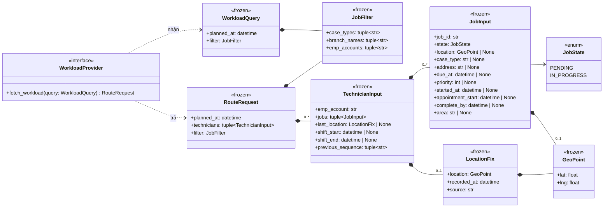
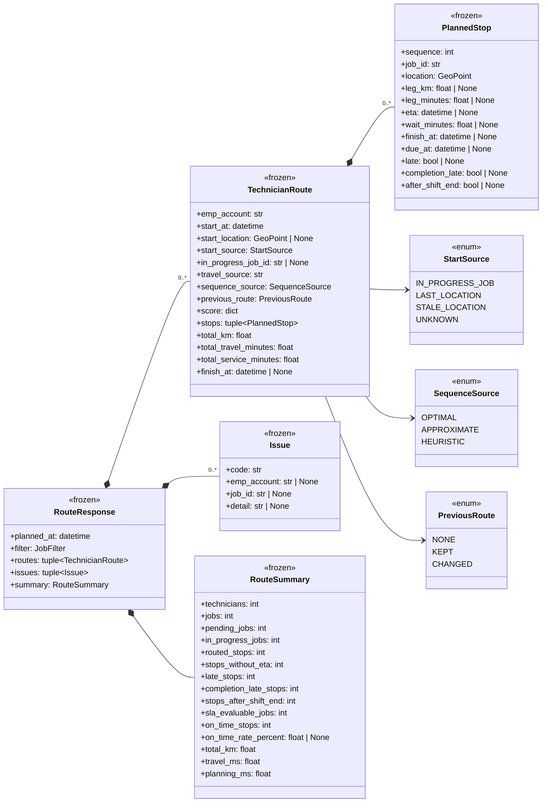
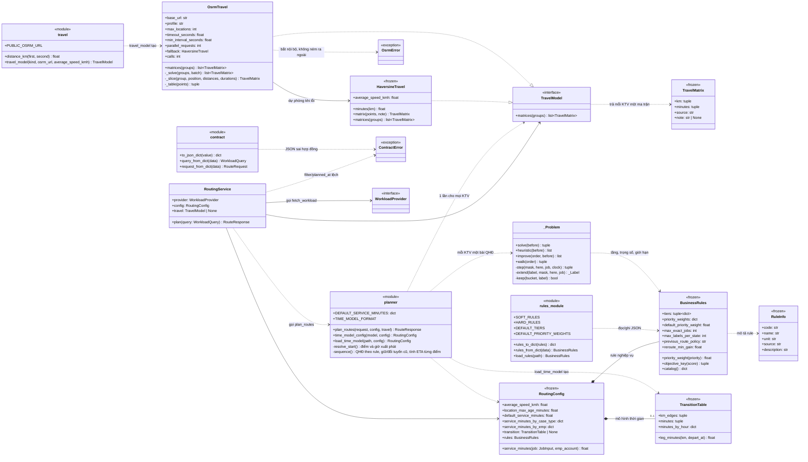
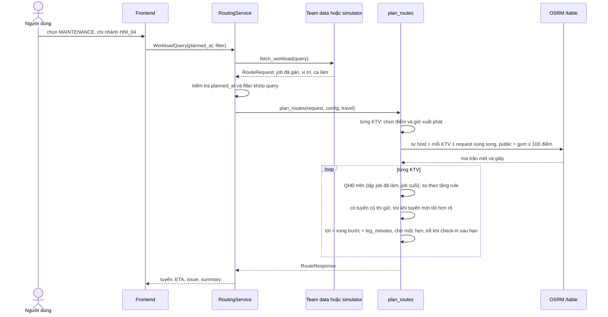
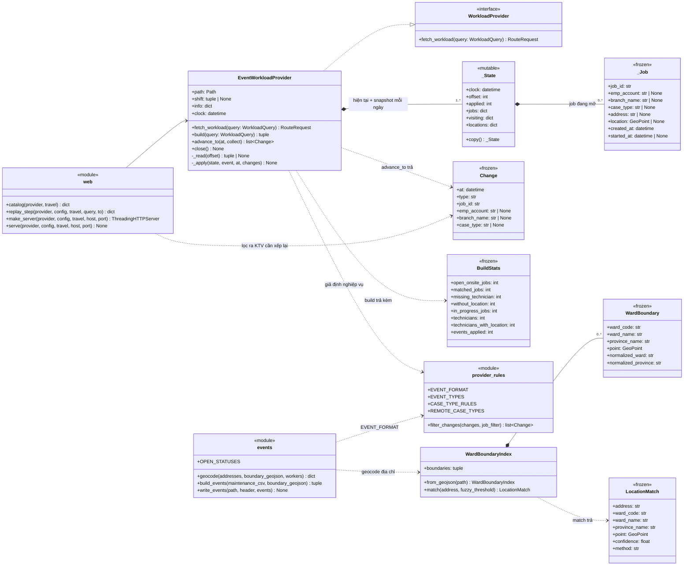
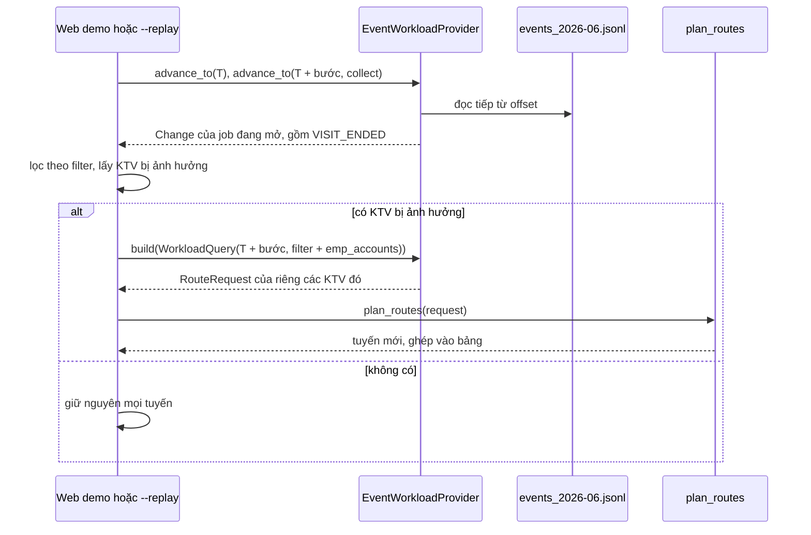
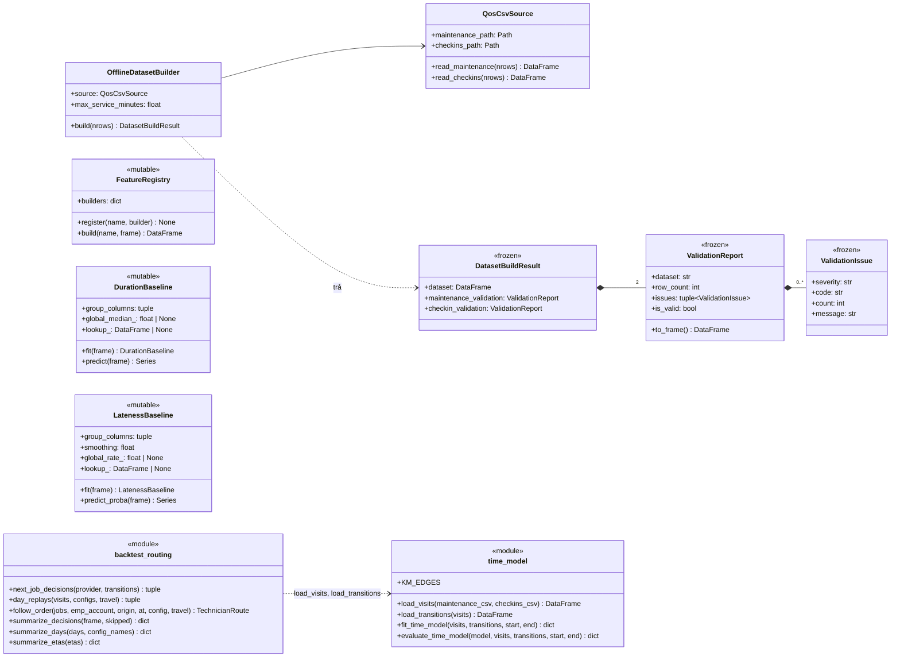

# UML — KTV Routing

Sơ đồ theo code hiện tại. Repo chia làm 3 phần:
- `src/ktv_routing`: phần deploy;
- `simulator/ktv_simulator`: tạm đóng vai team data, không deploy;
- `research`: phân tích offline.

| Ký hiệu | Nghĩa |
|---|---|
| `<<frozen>>` | `@dataclass(frozen=True, slots=True)`: tạo xong không sửa được |
| `<<mutable>>` | `@dataclass` thường |
| `<<enum>>` | `str, Enum`: ra JSON là chuỗi |
| `<<interface>>` | `Protocol`: phía team khác hiện thực |
| `<<module>>` | file chỉ gồm hàm/hằng, vẽ thành một khối |

## 1. Luồng giữa các team

## 2. Module và chiều import

Mũi tên nghĩa là "import". Không có mũi tên nào đi từ phần deploy sang simulator hay research.

## 3. Hợp đồng vào (`contract.py`)

## 4. Hợp đồng ra (`contract.py`)

## 5. Lõi routing (`planner.py`, `travel.py`, `service.py`, JSON)

## 6. Một lần lập tuyến

## 7. Simulator (`simulator/ktv_simulator`)

`provider_rules` là tên vẽ cho nhóm hằng số và hàm lọc ở đầu `provider.py`; `events` và `web` là hai file module. Không file nào là class.

### Một nhịp realtime (`web.replay_step`, dùng cho `--replay` và nút ▶ Chạy)

## 8. Research (`research/`)

## 9. File → nội dung

| File | Class / hàm chính |
|---|---|
| `src/ktv_routing/contract.py` | `WorkloadQuery`, `JobFilter`, `RouteRequest`, `TechnicianInput`, `JobInput`, `LocationFix`, `GeoPoint`, `JobState`, `WorkloadProvider`, `RouteResponse`, `TechnicianRoute`, `PlannedStop`, `Issue`, `RouteSummary`, `StartSource`, `ContractError`, `to_json_dict`, `query_from_dict`, `request_from_dict` |
| `src/ktv_routing/rules.py` | `BusinessRules`, `RuleInfo`, `SOFT_RULES`, `HARD_RULES`, `rules_to_dict`, `rules_from_dict`, `load_rules` — rule nghiệp vụ, tầng, trọng số |
| `src/ktv_routing/planner.py` | `RoutingConfig`, `TransitionTable`, `plan_routes` (QHĐ qua `_Problem`), `load_time_model`, `time_model_config` |
| `src/ktv_routing/travel.py` | `TravelModel`, `TravelMatrix`, `HaversineTravel`, `OsrmTravel`, `distance_km`, `travel_model` |
| `src/ktv_routing/service.py` | `RoutingService` |
| `simulator/ktv_simulator/events.py` | `build_events`, `write_events`, `geocode` + CLI — export QOS → luồng sự kiện JSONL (pandas) |
| `simulator/ktv_simulator/provider.py` | `EventWorkloadProvider`, `Change`, `BuildStats`, `filter_changes`, giả định SLA |
| `simulator/ktv_simulator/geocoding.py` | `WardBoundaryIndex`, `WardBoundary`, `LocationMatch` |
| `simulator/ktv_simulator/fake_boundary.py` | TẠM: `ward_and_province`, `build` — boundary giả từ check-in |
| `simulator/ktv_simulator/convert_xlsx.py` | `convert`, `read_shared_strings` — workbook → CSV UTF-8 |
| `simulator/ktv_simulator/web.py` + `web.html` | `make_server`, `serve`, `catalog`, `replay_step` — web demo: `GET /api/options`, `POST /api/plan`, `POST /api/replay` |
| `research/time_model.py` | `load_visits`, `load_transitions`, `fit_time_model`, `evaluate_time_model` + CLI — học thời gian làm và khoảng chuyển job |
| `research/backtest_routing.py` | `next_job_decisions`, `day_replays`, `follow_order` + CLI — planner so với KTV thật, sai số ETA |
| `research/qos_data.py` | `QosCsvSource`, chuẩn hóa CSV, `ValidationReport`, `ValidationIssue` |
| `research/features.py` | `FeatureRegistry`, `build_job_features`, `add_technician_history_features` |
| `research/baselines.py` | `DurationBaseline`, `LatenessBaseline` |
| `research/build_dataset.py` | `OfflineDatasetBuilder`, `DatasetBuildResult` + CLI |

## 10. Đã bỏ so với bản trước

| Phần cũ | Lý do |
|---|---|
| `domain/checklist_status.py`, `state/events.py` (8 status, vòng đời, event) | Việc của hệ thống checklist; routing chỉ cần `PENDING` / `IN_PROGRESS` |
| `storage/` SQLite, `pipeline/`, `evaluation/` | Việc của team database / BI; routing không lưu trạng thái |
| `optimization/assignment`, `compatibility`, `scoring`, `optimizer`, `domain/job`… | Routing không gán việc |
| 3 web demo trong `application/` | Việc của frontend |
